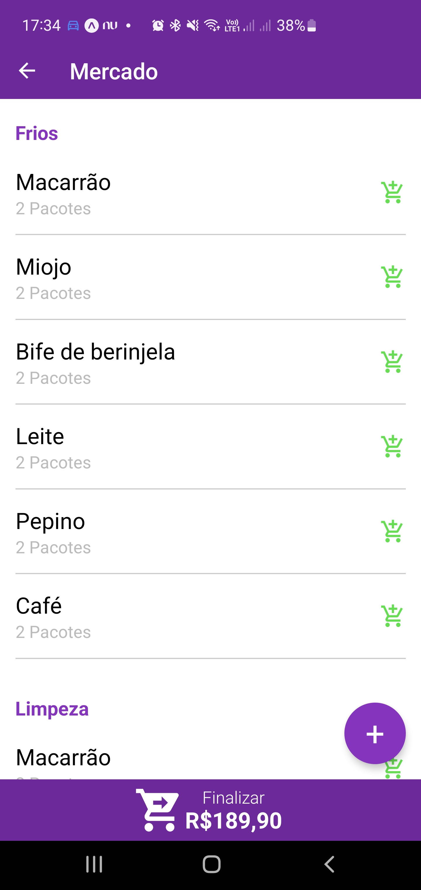
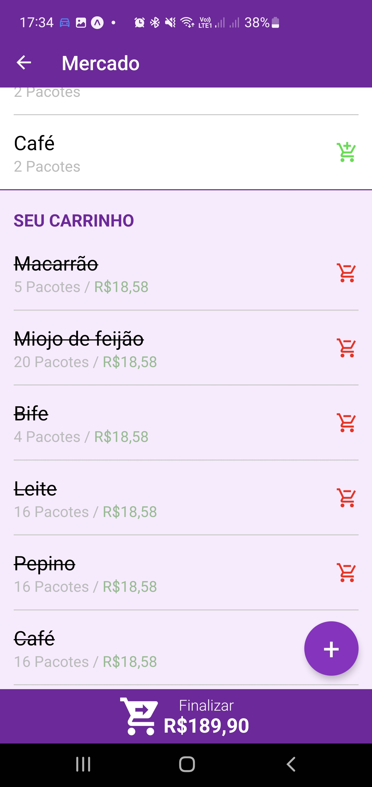

# My Buy - Alfa

O My Buy é um aplicativo criado em React Native, para controle de listas de compras. Atualmente ele está em versão alfa

## Últimas atualizações

- 11/04/2024 - Adicionadas as telas de gerenciamento de categorias e adicionar uma nova categoria.

## Funcionalidades e recursos desejados

- Cadastro de usuários
- Controle de listas
- Controle de itens da lista
- Compartilhamento de listas

## Funcionamento do sistema

O My Buy iniciará na tela de itens de uma determinada lista, nessa tela, o usuário irá vizualizar todos os itens da lista,
com a possibilidade de incluir, excluir e editar os produtos. Os produtos ficarão organizados por categoria (que o usuário terá controle total, adicionando e removendo categorias). Abaixo dos produtos da lista, ficará um espaço com os itens no carrinho.

Para adicionar itens no carrinho, o usuário poderá clicar no ícone verde ao lado do produto, e para remove-lo, irá clicar no ícone vermelho, também ao lado do item. Quando o usuário clicar no ícone verde, aparecerá uma tela modal, pra ele informar o preço por unidade do produto. Assim o sistema do carrinho, conseguirá somar o valor total da compra, para o usuário.

## Características

- Aplicativo React Native (Expo)
- Banco de dados relacional - MySql (API)
- Versão: Alfa